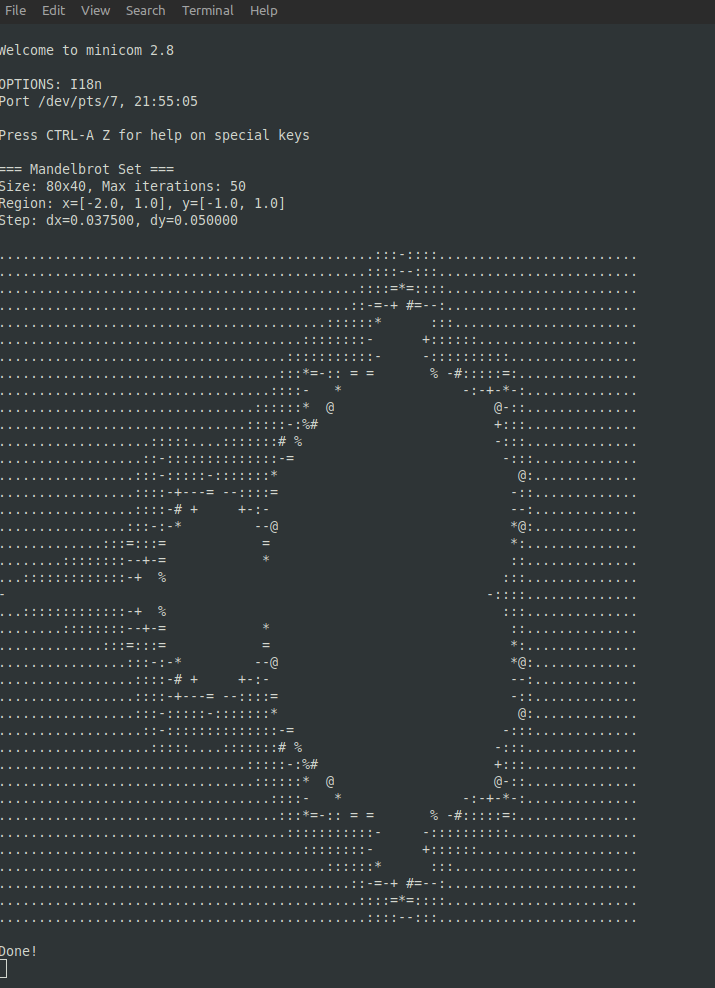
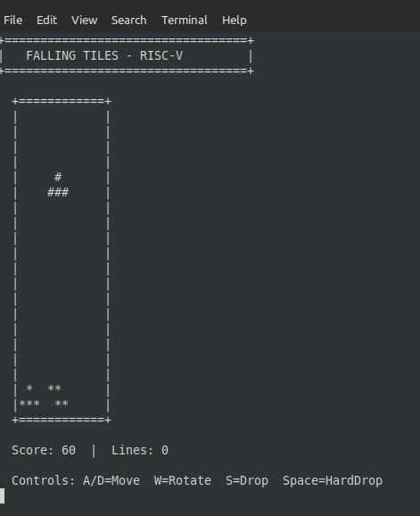

# RISC-V Emulator - Hands-On Tutorial
*A practical walkthrough of every feature, with real commands you can run.*

---

## Table of Contents

1. [What Is This?](#1-what-is-this)
2. [Build Everything](#2-build-everything)
3. [Running a Program](#3-running-a-program)
4. [Hardware Profiles (`--machine`)](#4-hardware-profiles---machine)
5. [The UART and PTY (`--pty`, `--wait`)](#5-the-uart-and-pty---pty---wait)
6. [Instruction Trace (`-t`)](#6-instruction-trace--t)
7. [Interactive Debugger (`-d`)](#7-interactive-debugger--d)
8. [GDB Remote Stub (`--gdb`)](#8-gdb-remote-stub---gdb)
9. [Instruction Profiler (`--profile`)](#9-instruction-profiler---profile)
10. [Instruction Coverage (`--coverage`)](#10-instruction-coverage---coverage)
11. [Binary Trace / Replay (`--irecord` / `--ireplay`)](#11-binary-trace--replay---irecord----ireplay)
12. [Running the Full Test Suite](#12-running-the-full-test-suite)
    - [12a. RV64 Programs](#12a-rv64-programs)
    - [12b. Sv39 Virtual Memory (MMU)](#12b-sv39-virtual-memory-mmu)
13. [RISC-V Architecture Compliance Tests](#13-risc-v-architecture-compliance-tests)
14. [Writing Your Own Test Program](#14-writing-your-own-test-program)
15. [C Runtime Library Reference](#15-c-runtime-library-reference)
16. [Peripheral Overview](#16-peripheral-overview)
17. [Quick-Reference Card](#17-quick-reference-card)

---

## 1. What Is This?

A bare-metal **RISC-V emulator** written in Ada. It lets you compile and
run embedded C programs on your host PC without real hardware. You get a full
instruction set (RV32IMAFDC + V + Zbb/Zbs/Zba/Zbkc/Zbkx + A + **RV64IMAFD**),
UART, SPI flash, GPIO, I2C, DMA, a cooperative and a **preemptive RTOS**,
an interactive debugger, a GDB remote stub, an instruction-level profiler,
instruction coverage tracking, binary trace/replay, and extended CSR support
(mcountinhibit, mcounteren, HPM stubs) - all in one binary.

**83 test programs, 2263 assertions - all passing.**

**Typical workflow:**

```
write C code  ->  compile with riscv32-unknown-elf-gcc  ->  run in emulator
                                                             |
                                                       view UART output
                                                       step in GDB
                                                       profile hot spots
```

---

## 2. Build Everything

### Emulator (Ada)

```bash
cd /path/to/riscv          # repo root
make                        # produces bin/riscv_emulator
```

### C Test Programs

```bash
cd programs
make all                    # builds all ~45 programs into out/elf/ and out/bin/
```

Or build one at a time, naming the output file rather than the program:

```bash
make out/bin/branch-test.bin   # also produces out/elf/branch-test.elf
```

The bare program names (`make branch-test`) are listed in `.PHONY` but have no
rules behind them, so make reports "Nothing to be done" and builds nothing.

### Prerequisites

- GNAT Ada compiler (`gnat` / `gnatmake`)
- A bare-metal RISC-V cross-compiler; the Makefiles default to the
  `riscv32-unknown-elf-` prefix, overridable with `make CROSS=...`
- Standard build tools (`make`, `objcopy`, `objdump`)

To install a cross-compiler, or to compile a C program of your own, see
[doc/WRITING-PROGRAMS.md](doc/WRITING-PROGRAMS.md).

---

## 3. Running a Program

### Basic run

```bash
# From the repo root:
bin/riscv_emulator --machine qemu-virt programs/out/elf/branch-test.elf
```

Expected output:
```
Loading ELF file: programs/out/elf/branch-test.elf
Starting emulation...

=== Branch Test ===
ALL PASSED

Emulation stopped.
...
Return value (a0): 0
```

The program prints to the UART; the emulator forwards that to stdout.

### Quiet mode

Suppresses all emulator boilerplate - useful in scripts:

```bash
bin/riscv_emulator --machine qemu-virt -q programs/out/elf/branch-test.elf
```
Output:
```
=== Branch Test ===
ALL PASSED
```

### Raw binary instead of ELF

If you have a flat binary (e.g. from `objcopy -O binary`):

```bash
bin/riscv_emulator --machine qemu-virt programs/out/bin/branch-test.bin 80000000
#                                                                        ^^^^^^^^^
#                                                               load address in hex
```

### Limit execution length

Prevents runaway programs from looping forever:

```bash
bin/riscv_emulator --machine qemu-virt --max-instructions 1000000 programs/out/elf/branch-test.elf
```

---

## 4. Hardware Profiles (`--machine`)

The emulator needs to know where RAM and peripherals live. Use `--machine` to
select a built-in profile. **Always specify it when running programs.**

```bash
bin/riscv_emulator --list-machines
```

```
Available hardware profiles:

  simple
    Memory: 1 MB RAM at 0x00000000
    UART:   0x10000000
    Reset:  0x00000000
    Stack:  0x00100000

  qemu-virt
    Memory: 128 MB RAM at 0x80000000
            64 KB ROM at 0x00001000
    UART:   0x10000000
    CLINT:  0x02000000 (timer)
    PLIC:   0x0C000000 (external interrupt controller, 32 sources, 2 contexts)
    GPIO:   0x10010000
    SPI:    0x10020000 (+ 64KB flash)
    I2C:    0x10030000
    Timer:  0x10040000
    Watchdog: 0x10050000
    DMA:    0x10060000
    VirtIO Block: 0x10001000 (512KB disk, PLIC source 8)
    Reset:  0x80000000
    Stack:  0x88000000
```

All C programs in `programs/` target **qemu-virt**. Use `simple` only for tiny
raw binaries you link yourself.

```bash
# qemu-virt - the standard choice
bin/riscv_emulator --machine qemu-virt programs/out/elf/sha256-test.elf

# simple - 1 MB flat memory, minimal peripherals
bin/riscv_emulator --machine simple my-raw.bin 0
```

---

## 5. The UART and PTY (`--pty`, `--wait`)

Every program in `programs/` calls `uart_puts()` / `putchar()` to write to the
emulated UART. By default the emulator just prints those bytes to stdout.

If you want a proper serial terminal experience (e.g. to interact with an
interactive program), connect the UART to a **PTY** (pseudo-terminal):

### Step 1 - start the emulator with `--pty`

```bash
bin/riscv_emulator --machine qemu-virt --pty programs/out/elf/echo.elf
```

Output:
```
UART PTY: /dev/pts/5  (connect with: minicom -D /dev/pts/5)
```

### Step 2 - connect minicom (or screen) in another terminal

```bash
minicom -D /dev/pts/5
# or
screen /dev/pts/5
```

### `--wait` - pause until PTY is connected

Some programs produce output immediately and you'd miss it before minicom opens.
`--wait` pauses execution until you press a key in minicom:

```bash
bin/riscv_emulator --machine qemu-virt --pty --wait programs/out/elf/cli.elf
```

The emulator prints `Waiting for connection... Press any key in minicom to start.`
and holds there until you press a key in your terminal.

### Worked example 1 - a program that runs to completion

`mandelbrot` prints its output once and exits, which is exactly the case `--wait`
exists for: without it the ASCII art scrolls past before minicom is open.

Terminal 1 (from the `programs/` directory):

```bash
../bin/riscv_emulator --machine qemu-virt --pty --wait out/bin/mandelbrot.bin 80000000
```

Terminal 2, using the PTY number the emulator just printed:

```bash
minicom -D /dev/pts/7
```

Press any key to release the `--wait` barrier. minicom keeps its own banner at the
top, so you can see the connection details and the program output together:



The `Port /dev/pts/7` line is minicom confirming which PTY it attached to - it
should match the one the emulator printed. `Done!` is the program's own last line;
the emulator keeps running after it, so exit minicom with `Ctrl-A X` and stop the
emulator with `Ctrl-C`.

### Worked example 2 - an interactive program

`falling-tiles` reads the keyboard through the same UART and redraws the whole
screen every frame, so it needs the terminal on the other end of the PTY:

```bash
../bin/riscv_emulator --machine qemu-virt --pty --wait out/bin/falling-tiles.bin 80000000
```



Controls are `A`/`D` to move, `W` to rotate, `S` to soft drop and `Space` to hard
drop (the vim keys `h`/`j`/`k`/`l` work too). There is no in-game quit key.

If the board smears instead of redrawing cleanly, turn off minicom's line wrap with
`Ctrl-A W` - the game repaints from the home position each frame and assumes
nothing else is wrapping its lines.

### Other interactive demo programs

Same recipe, any of these:

```bash
# Command-line shell demo
bin/riscv_emulator --machine qemu-virt --pty --wait programs/out/elf/cli.elf

# Tetris-like falling tiles
bin/riscv_emulator --machine qemu-virt --pty --wait programs/out/elf/falling-tiles.elf

# Conway's Game of Life
bin/riscv_emulator --machine qemu-virt --pty --wait programs/out/elf/game-of-life.elf
```

The ELF and the raw `.bin` are interchangeable here - the `.bin` form just needs the
load address `80000000` spelled out, because a raw image carries no entry point.

---

## 6. Instruction Trace (`-t`)

The trace prints every instruction that executes, in the format:

```
<pc>: <encoding>  <mnemonic>  <operands>
```

### Enable trace

```bash
bin/riscv_emulator --machine qemu-virt -t -q programs/out/elf/branch-test.elf 2>/dev/null | head -20
```

```
80000000:  00100117  auipc   sp, 0x100
80000004:  00010113  mv      sp, sp
80000008:  00001297  auipc   t0, 0x1
8000000c:  5a028293  addi    t0, t0,  1440
80000010:  00001317  auipc   t1, 0x1
80000014:  5a030313  addi    t1, t1,  1440
80000018:  0062d663  bge     t0, t1, 0x80000024
8000001c:  0002a023  sw      x0,  0(t0)
80000020:      00428293  [C] addi    t0, t0,  4      <- [C] = 16-bit compressed
80000022:      ff7ff06f  [C] j       0x80000018
```

### Save trace to file

```bash
bin/riscv_emulator --machine qemu-virt --trace-file trace.txt -q programs/out/elf/crc32-test.elf
wc -l trace.txt      # how many instructions executed
head -30 trace.txt
```

### Trace only a PC range

Useful to zoom in on one function without drowning in startup noise:

```bash
# Find the address of main first:
riscv32-unknown-elf-nm programs/out/elf/branch-test.elf | grep ' main'
# e.g.:  800006e6 T main

bin/riscv_emulator --machine qemu-virt \
  --trace-range 800006e6 80000800 \
  programs/out/elf/branch-test.elf
```

### Show memory accesses (`--trace-mem`)

Each instruction is followed by the memory address it read from or wrote to:

```bash
bin/riscv_emulator --machine qemu-virt -t --trace-mem -q \
  programs/out/elf/aes128.elf 2>/dev/null | head -30
```

### Show register changes (`--trace-regs`)

Prints the registers that changed value after each instruction:

```bash
bin/riscv_emulator --machine qemu-virt -t --trace-regs -q \
  programs/out/elf/aes128.elf 2>/dev/null | head -40
```

---

## 7. Interactive Debugger (`-d`)

Start the emulator in debug mode. Execution stops immediately and you get a
REPL prompt:

```bash
bin/riscv_emulator --machine qemu-virt -d programs/out/elf/branch-test.elf
```

```
Loading ELF file: programs/out/elf/branch-test.elf
Symbols loaded: 47

(dbg)
```

### Command overview

| Command | What it does |
|---------|-------------|
| `s` | Single step (one instruction) |
| `n` | Step over (run until next instruction in same function) |
| `c` | Continue (run until breakpoint/watchpoint) |
| `q` | Quit |
| `r` | Dump all integer registers (x0-x31 + PC) |
| `fregs` | Dump floating-point registers (f0-f31) |
| `vregs` | Dump vector registers (formatted by current SEW) |
| `b <addr>` | Set breakpoint at hex address |
| `bl` | List all breakpoints |
| `bc <n>` | Clear breakpoint number n |
| `watch <addr> [r\|w\|rw]` | Set memory watchpoint (default: write) |
| `wl` | List all watchpoints |
| `wc <n\|all>` | Clear watchpoint n (or all) |
| `m <addr> [n]` | Hex dump: n bytes at address |
| `d <addr> [n]` | Disassemble n instructions at address |
| `sym <name>` | Look up a symbol by name -> address |
| `syms` | List all loaded symbols |
| `bt` | Stack backtrace |

### Walkthrough: debug branch-test

```
(dbg) sym main
  main = 0x800006e6

(dbg) b 800006e6      <- breakpoint at main
Breakpoint set at 0x800006e6

(dbg) c               <- run until breakpoint
=== Branch Test ===   <- UART output appears inline
Hit breakpoint at 0x800006e6

(dbg) r               <- see all registers
PC  = 0x800006e6
x0  = 0x00000000  x1  = 0x80000026  x2  = 0x80100000  ...

(dbg) d 800006e6 10   <- disassemble 10 instructions
800006e6:  80001537  lui     a0, 0x80001
800006ea:  fe010113  addi    sp, sp,  -32
800006ec:  da050513  addi    a0, a0, -608
...

(dbg) s               <- single step
800006ea:  fe010113  addi    sp, sp,  -32

(dbg) n               <- step over (skips over a function call)

(dbg) bt              <- where am I?
#0  0x800006f0  main
#1  0x80000026  _start

(dbg) m 80100000 32   <- peek at the stack
80100000: 00 00 00 00 00 00 00 00 00 00 00 00 00 00 00 00
80100010: 00 00 00 00 00 00 00 00 00 00 00 00 00 00 00 00

(dbg) q
```

### Walkthrough: memory watchpoint

```
(dbg) sym g_pass      <- find the global variable
  g_pass = 0x80001000

(dbg) watch 80001000  <- watch for writes to g_pass
Watchpoint set: write @ 0x80001000

(dbg) c               <- run
Hit watchpoint (write) at 0x80001000  PC=0x800006de
                                           ^
                              stopped inside check(), where g_pass++

(dbg) r               <- check registers
...

(dbg) wl
  WP 1: write @ 0x80001000

(dbg) wc 1            <- clear it
```

### Vector registers

When the program uses RVV instructions, `vregs` shows all 32 vector registers
formatted by the current SEW (element width):

```
(dbg) vregs
VL=8  VStart=0  SEW=32 (4 elements/reg)  LMUL=1

v0:  [ 00000000 00000000 00000000 00000000 ]
v1:  [ 3f800000 3f800000 3f800000 3f800000 ]
...
```

### 7a. Debugging RV64 programs

The interactive debugger works identically for RV64 ELF files. The emulator
auto-detects the ELF class and uses the `CPU64_State`:

```bash
bin/riscv_emulator --machine qemu-virt -d programs/out/elf/rv64-test.elf
```

The prompt changes to `(riscv64)` so you can tell them apart. All debugger
commands work the same way: `s`, `c`, `b`, `r`, `fregs`, `m`, `d`, `bt`,
`watch`, `trace`, `sym`, etc. Registers are displayed in 64-bit hex (16 hex
digits wide).

---

## 8. GDB Remote Stub (`--gdb`)

The emulator implements the **GDB Remote Serial Protocol (RSP)**. You can use
the real `riscv32-unknown-elf-gdb` to connect and debug as if it were real
hardware.

### Start the emulator in GDB mode

```bash
# Terminal 1 - emulator listens on port 1234 (default)
bin/riscv_emulator --machine qemu-virt --gdb programs/out/elf/branch-test.elf
```
```
GDB server listening on port 1234
Waiting for GDB connection...
```

Or use a custom port:
```bash
bin/riscv_emulator --machine qemu-virt --gdb 2345 programs/out/elf/branch-test.elf
```

### Connect with GDB

```bash
# Terminal 2
riscv32-unknown-elf-gdb programs/out/elf/branch-test.elf
```

```gdb
(gdb) target remote localhost:1234
Remote debugging using localhost:1234
_start () at crt0.S:6
6       la sp, _stack_top

(gdb) break main
Breakpoint 1 at 0x800006e6: file branch-test.c, line 267.

(gdb) continue
Continuing.
Breakpoint 1, main () at branch-test.c:267
267     uart_puts("=== Branch Test ===\n");

(gdb) info registers
pc             0x800006e6
sp             0x80100000
...

(gdb) stepi
0x800006ea in main () at branch-test.c:267
267     uart_puts("=== Branch Test ===\n");

(gdb) next
=== Branch Test ===
268     test_beq();
```

### Hardware watchpoints

```gdb
(gdb) watch g_pass          <- write watchpoint
Hardware watchpoint 2: g_pass

(gdb) rwatch g_pass         <- read watchpoint
Hardware read watchpoint 3: g_pass

(gdb) awatch g_pass         <- read+write watchpoint
Hardware access (read/write) watchpoint 4: g_pass

(gdb) continue
Hardware watchpoint 2: g_pass
Old value = 0
New value = 1
check (label=...) at branch-test.c:31
31      g_pass++;

(gdb) delete watchpoints
(gdb) continue
```

### Software breakpoints

```gdb
(gdb) break test_beq
(gdb) break *0x80000750     <- by address
(gdb) info breakpoints
(gdb) delete 1
```

### Non-interactive (batch) use - useful in CI

```bash
riscv32-unknown-elf-gdb -batch \
  -ex "target remote localhost:1234" \
  -ex "break main" \
  -ex "continue" \
  -ex "info registers" \
  -ex "detach" \
  programs/out/elf/branch-test.elf
```

### Debugging RV64 programs

Use `riscv64-unknown-elf-gdb` (or a multiarch GDB) instead of the RV32 variant.
The emulator detects the ELF class automatically and switches to 64-bit register
encoding (16 hex chars per register instead of 8).

```bash
# Terminal 1
bin/riscv_emulator --machine qemu-virt --gdb programs/out/elf/rv64-test.elf
```

```bash
# Terminal 2
riscv64-unknown-elf-gdb programs/out/elf/rv64-test.elf
```

```gdb
(gdb) target remote localhost:1234
Remote debugging using localhost:1234
_start () at crt0-64.S:6

(gdb) break main
Breakpoint 1 at 0x800001a8

(gdb) continue
Continuing.
Breakpoint 1, main ()

(gdb) info registers
pc             0x800001a8
sp             0x80100000
a0             0x0
...

(gdb) stepi
(gdb) x/4gx $sp           <- examine 64-bit words on stack
(gdb) set $a0 = 42        <- write 64-bit register
```

Everything else (watchpoints, breakpoints, batch mode) works identically to RV32.
The GDB client determines the register width from the target XML served on connect.

### Supported RSP features

| Feature | GDB command | RSP packet |
|---------|-------------|------------|
| Read all regs | `info registers` | `g` |
| Write register | `set $a0 = 5` | `P` |
| Read memory | `x/16xb 0x80001000` | `m` |
| Write memory | `set {int}0x80001000 = 42` | `M` |
| Continue | `continue` | `c` / `vCont;c` |
| Single step | `stepi` | `s` / `vCont;s` |
| SW breakpoint | `break` | `Z0` / `z0` |
| Write watch | `watch` | `Z2` / `z2` |
| Read watch | `rwatch` | `Z3` / `z3` |
| Access watch | `awatch` | `Z4` / `z4` |
| Target XML | auto (on connect) | `qXfer:features:read` |
| No-ack mode | auto | `QStartNoAckMode` |
| Detach | `detach` | `D` |

RV32 registers are encoded as 8 hex chars; RV64 as 16 hex chars. The emulator
selects the encoding based on the ELF class of the loaded program.

---

## 9. Instruction Profiler (`--profile`)

The profiler records every instruction executed and produces a report when the
program exits. It is designed for low overhead: symbol lookups only happen on
call/return transitions, and hot-PC sampling runs every 10,000 instructions.

### Basic run

```bash
bin/riscv_emulator --machine qemu-virt --profile programs/out/elf/fir-filter.elf
```

```
=== FIR Filter Test ===
ALL PASSED

=== Profiling Report ===
Total instructions: 108678

--- Function Profile (top 20 by cycles) ---
 Cycles         %    Instructions    Calls  Function
 ----------  ----    ------------    -----  --------------------------------
 45506       41%         45506            0  log_write
 25216       23%         25216            0  fir_scalar.constprop.0
 19638       18%         19638          192  fir_rvv.constprop.0
 10176        9%         10176            0  vec_dot
 ...

--- Instruction Histogram (by opcode) ---
 Opcode     Name        Count           %
 --------   ----------  ----------      ---
 0x13       OP-IMM      40697            37%
 0x63       BRANCH      18855            17%
 0x33       OP          14794            13%
 0x03       LOAD        14220            13%
 0x23       STORE       10318             9%
 0x57       OP-V         3762             3%
 ...

--- Hot Instructions (top 20 PCs) ---
 PC          Count           %   Symbol
 ----------  ----------      ---  --------------------------------
 0x80000fb0  46               0%  fir_scalar.constprop.0
 0x80000fbc  40               0%  fir_scalar.constprop.0
 ...
```

**Reading the output:**

- **Function Profile** - which functions consume the most CPU cycles.
  "Calls = 0" means the function was active at program start (no tracked call
  site) or that call-tracking missed it due to indirect calls/inlining.
- **Instruction Histogram** - breakdown by opcode category. High BRANCH% often
  means loop-heavy code; high LOAD/STORE% can indicate cache-pressure hotspots.
- **Hot Instructions** - individual PCs executed most often. Great for finding
  the inner loop body.

### Flamegraph export

Exports a folded-stack file compatible with Brendan Gregg's `flamegraph.pl`:

```bash
bin/riscv_emulator --machine qemu-virt \
  --flamegraph fir.fg \
  programs/out/elf/fir-filter.elf

# Generate the SVG (requires flamegraph.pl)
flamegraph.pl fir.fg > fir.svg
# Open fir.svg in a browser for an interactive flamegraph
```

### Comparing scalar vs. RVV

Profile the sort benchmark to see how much time each sort variant takes:

```bash
bin/riscv_emulator --machine qemu-virt --profile programs/out/elf/sort-bench.elf
# Look at the function profile to compare quicksort / heapsort / mergesort cycles
```

### Profiling RV64 programs

`--profile` and `--coverage` work identically with RV64 ELF files. The emulator
auto-detects the ELF class:

```bash
bin/riscv_emulator --machine qemu-virt --profile programs/out/elf/rv64-sha256-test.elf
```

Hot-PC addresses in the report are the lower 32 bits of the 64-bit PC (the
symbol-lookup table is indexed by the 32-bit load segment base), so function
names and offsets resolve correctly for programs loaded at 0x80000000.

---

## 10. Instruction Coverage (`--coverage`)

Coverage tracking records **which instruction addresses were actually executed**
and produces a report with an overall percentage plus a per-function breakdown.

### Run with coverage

```bash
# Write report to coverage.txt (default filename)
bin/riscv_emulator --machine qemu-virt --coverage programs/out/elf/sha256-test.elf

# Custom filename
bin/riscv_emulator --machine qemu-virt --coverage sha256-cov.txt programs/out/elf/sha256-test.elf
```

### Sample report

```
=== RISC-V Instruction Coverage Report ===
Base PC : 0x80000000
Slots   :  894  ( 3576 bytes)
Covered :  608 /  894  068.0%

--- Per-Function Coverage ---

sha256_block                             100.0%  ( 137 / 137)
sha256                                   089.5%  (  77 /  86)
check_hash                               060.6%  (  20 /  33)
log_write                                037.7%  ( 131 / 347)
puts                                     000.0%  (   0 /  16)
main                                     088.4%  ( 176 / 199)
getchar                                  000.0%  (   0 /   6)
```

**Reading the output:**

- **Overall 68.0%** - roughly 2/3 of all instruction slots in the binary were reached.
- **sha256_block 100%** - every instruction in the core hash function executed.
  Good: this is the critical path and it is fully exercised.
- **puts 0%** / **getchar 0%** - these functions are compiled in (via the C library)
  but never called by the test. True dead code.
- **log_write 37.7%** - the log library has many format-handling branches; not all
  format specifiers are exercised by this test.

**Per-function stats require an ELF file.** Raw `.bin` files have no symbol table
so only the overall percentage is shown.

### Combine with profiling

Both tools can run in the same pass:

```bash
bin/riscv_emulator --machine qemu-virt \
  --profile \
  --coverage sha256-cov.txt \
  programs/out/elf/sha256-test.elf
```

### Use cases

| Goal | What to look for |
|------|-----------------|
| Find untested code | Functions showing 0% |
| Measure test quality | Overall % and functions below 80% |
| Spot dead code | Functions that are always 0% across all test runs |
| CI coverage gate | Parse `Covered : N / M` and fail if N/M < threshold |

---

## 11. Binary Trace / Replay (`--irecord` / `--ireplay`)

Trace/replay captures a **binary log of every instruction** the CPU executes and
can replay it against a second run to detect any divergence.  The primary use case
is **emulator regression testing**: record a known-good run, then replay after
changing the emulator to confirm nothing broke.

### Record format (20 bytes per instruction)

| Offset | Field | Description |
|--------|-------|-------------|
| 0 | PC | Program counter before execution |
| 4 | Encoding | Raw 32-bit instruction word |
| 8 | Rd | Destination register index (0 = none / x0) |
| 12 | Rd_Value | Value written to Rd after execution |
| 16 | Next_PC | Program counter after execution |

### Recording a trace

```bash
bin/riscv_emulator --machine qemu-virt \
  --irecord sha256.trace \
  programs/out/elf/sha256-test.elf
```

```
ALL PASSED
Instruction trace written to sha256.trace ( 60630 records)
```

File size = records * 20 bytes (60630 records ~ 1.2 MB).

### Replaying and verifying

```bash
bin/riscv_emulator --machine qemu-virt \
  --ireplay sha256.trace \
  programs/out/elf/sha256-test.elf
```

**Success:**
```
ALL PASSED
Replay OK - 60630 steps matched.
```

**Failure (different binary, or emulator bug):**
```
MISMATCH at step 4 PC=0x8000000c x5=0x80001140 expected=0x80001438
Replay FAILED - 1 mismatch(es).
```

The replay stops at the **first** mismatch and tells you:
- Which step diverged
- The PC at that point
- What field differs (Next_PC or register value) and both the actual and expected values

### Emulator regression workflow

```bash
# Step 1 - record reference trace with the current (known-good) emulator
bin/riscv_emulator --machine qemu-virt \
  --irecord ref.trace programs/out/elf/sha256-test.elf

# Step 2 - modify emulator source (edit src/riscv-cpu.adb, etc.)
#           then rebuild:
make

# Step 3 - replay to confirm no regression
bin/riscv_emulator --machine qemu-virt \
  --ireplay ref.trace programs/out/elf/sha256-test.elf
# Replay OK - 60630 steps matched.   <- change is safe
# MISMATCH at step 1234 ...          <- something broke; step 1234 is the first bad instruction
```

### Determinism check

Use replay to confirm that two runs of the same binary produce identical results:

```bash
bin/riscv_emulator --machine qemu-virt --irecord run1.trace prog.elf
bin/riscv_emulator --machine qemu-virt --ireplay run1.trace prog.elf
# Replay OK - N steps matched.   <- execution is deterministic
```

---

## 12. Running the Full Test Suite

All 83 test programs can be run in one go from `programs/`:

```bash
cd programs
./test-all.sh
```

```
TEST                        PASS   FAIL STATUS
----                        ----   ---- ------
branch-test                   56      0 OK
load-store-test               56      0 OK
csr-test                      48      0 OK
trap-test                     18      0 OK
...
hmac-sha256-test               7      0 OK
aes-modes-test                 6      0 OK
csr-more-test                 16      0 OK

---                         ----   ----
TOTAL                       2263      0

All tests PASSED (2263 assertions).
```

### Rebuild before running

```bash
./test-all.sh --rebuild     # re-compiles all programs, then runs them
```

### What each test covers

| Group | Tests |
|-------|-------|
| **ISA (RV32)** | branch-test, load-store-test, csr-test, trap-test, m-ext-test, float-classify, zbb-test, zba-test, atomic-test, clmul-test |
| **ISA (RV64)** | rv64-test (64-bit arith/LD/SD/W-ops), rv64-fp-test (FCVT.L.D, FMV.X.D, etc.) |
| **FP / Vector** | fp-math-test, rvv-advanced, rvv-float, rvv-strided, fir-filter |
| **String / C lib** | string-ops, scanf-test |
| **Compression** | lz77, huffman, deflate-test |
| **Crypto** | sha256-test, crc32-test, aes128, chacha20, chacha20-poly1305, aes-gcm, blake2s, sha3 |
| **Crypto suites** | hmac-sha256-test, aes-modes-test |
| **Math / DSP** | fixedpoint-test, fft-test, fir-filter, iir-test, pid-test, lfsr-test, fft-conv |
| **Public-key crypto** | montgomery-test, reed-solomon-test, ntt-test, ecc-test, rs-correct-test |
| **Coding theory** | viterbi |
| **Data structures** | sort-bench, gf256-test |
| **Extended CSRs** | csr-more-test |
| **Embedded workloads** | rtos-test, fat12-test, modbus-test, setjmp-test, smode-test, prtos-test |

---

## 12a. RV64 Programs

Two test programs target the **64-bit** RV64 ISA. They are compiled as ELF64
files and run directly (no `.bin` + address form needed).

### Build

```bash
cd programs
make rv64-test rv64-fp-test
```

Produces `out/elf/rv64-test.elf` and `out/elf/rv64-fp-test.elf`.

### Run

```bash
# 64-bit integer arithmetic, LD/SD, ADDIW, MULW, 64-bit div/rem
bin/riscv_emulator --machine qemu-virt programs/out/elf/rv64-test.elf

# RV64 FPU: double-precision, FCVT.L.D/LU.D/D.L/D.LU, FMV.X.D/D.X, FCLASS.D
bin/riscv_emulator --machine qemu-virt programs/out/elf/rv64-fp-test.elf
```

The emulator **auto-detects** the ELF class (32 vs 64-bit) from the ELF header
and selects the correct CPU core automatically.

### Compiler flags for RV64

```makefile
CC      = riscv32-unknown-elf-gcc    # same toolchain, different march/mabi
ARCH64  = rv64imafd
ABI64   = lp64d
CFLAGS64 = -march=$(ARCH64) -mabi=$(ABI64) -mcmodel=medany \
           -nostdlib -nostartfiles -fno-builtin -O2 -g
```

Use `crt0-64.S` (BSS zeroed with `sd`/8-byte steps) and `log64.c`
(semihosting log using `long` for 64-bit pointer arguments) instead of their
RV32 counterparts.

### test-all.sh integration

RV64 tests use the optional 4th field `elf` in the `TESTS` array, which
instructs the harness to pass the ELF file directly rather than `.bin` + load address:

```bash
"rv64-test    rv64-test    rv64-test.log    elf"
"rv64-fp-test rv64-fp-test rv64-fp-test.log elf"
```

---

## 12b. Sv39 Virtual Memory (MMU)

RV64 programs can use **Sv39** virtual memory by writing to the `satp` CSR
from S-mode. The emulator translates every instruction fetch, load, and store
through the page table when `satp.MODE=8`.

### How it works

- 39-bit virtual address space: VPN[2] (bits 38:30), VPN[1] (bits 29:21), VPN[0] (bits 20:12), 12-bit page offset
- Three-level page table walk starting from `satp.PPN * 4096`
- Each PTE is 8 bytes: PPN (bits 53:10), flags V/R/W/X/U/G/A/D (bits 7:0)
- Superpages: 1 GB (leaf at level 2), 2 MB (leaf at level 1), 4 KB (leaf at level 0)
- 64-entry TLB with ASID support and round-robin replacement
- `sfence.vma` flushes the TLB
- Page faults: instruction fault (scause=12), load fault (scause=13), store fault (scause=15)
- `stval` holds the faulting virtual address
- M-mode always bypasses translation (physical addresses)

### Minimal identity-mapping example

```c
#include <stdint.h>

/* 4 KB-aligned level-2 page table (512 entries * 8 bytes) */
static uint64_t sv39_l2[512] __attribute__((aligned(4096)));

#define PTE_V  (1ULL<<0)
#define PTE_R  (1ULL<<1)
#define PTE_W  (1ULL<<2)
#define PTE_X  (1ULL<<3)
#define PTE_A  (1ULL<<6)
#define PTE_D  (1ULL<<7)
#define PTE_LEAF (PTE_V|PTE_R|PTE_W|PTE_X|PTE_A|PTE_D)

void setup_sv39(void)
{
    /*
     * Create one 1 GB superpage at VA 0x80000000 (VPN[2] = 2).
     * PPN for a 1 GB page starting at PA 0x80000000:
     *   PPN = PA >> 12 = 0x80000
     *   PTE = (PPN << 10) | PTE_LEAF = 0x200000CF
     */
    sv39_l2[2] = (0x80000ULL << 10) | PTE_LEAF;   /* identity-map 0x80000000-0xBFFFFFFF */

    /* Enable Sv39: MODE=8, ASID=0, PPN = physical addr of l2 table >> 12 */
    uint64_t satp = (8ULL << 60) | ((uint64_t)sv39_l2 >> 12);
    asm volatile("csrw satp, %0\n sfence.vma" :: "r"(satp) : "memory");
}
```

### Page fault handler

```c
static volatile uint64_t g_fault_cause, g_fault_tval;

void __attribute__((naked)) strap_handler(void)
{
    asm volatile(
        "csrr t0, scause\n"  "la t1, g_fault_cause\n"  "sd t0, 0(t1)\n"
        "csrr t0, stval\n"   "la t1, g_fault_tval\n"   "sd t0, 0(t1)\n"
        "csrr t0, sepc\n"    "addi t0, t0, 4\n"         "csrw sepc, t0\n"
        "sret\n"
    );
}

/* install in smode_main() before enabling MMU: */
asm volatile("csrw stvec, %0" :: "r"(strap_handler));
```

### Disabling the MMU

```c
asm volatile("csrw satp, zero\n sfence.vma" ::: "memory");
/* back to bare/physical-address mode */
```

### Test program

`programs/sv39-test.c` (run via ELF, S-mode, 9 assertions):

```bash
cd programs && make sv39-test
bin/riscv_emulator --machine qemu-virt programs/out/elf/sv39-test.elf
```

---

## 13. RISC-V Architecture Compliance Tests

The `arch-test/` directory integrates the official
[riscv-arch-test](https://github.com/riscv-non-isa/riscv-arch-test) suite as a
**git submodule** (pinned to the `old-framework-2.x` branch, which carries
pre-built reference signatures).

### First-time setup

After cloning this repo you need to pull the submodule content:

```bash
git submodule update --init
```

This fetches `arch-test/riscv-arch-test/` from GitHub. You only need to do it
once (or again after `git pull` bumps the pinned commit).

### Running compliance tests

```bash
cd arch-test

make test-I        # RV32I base integer tests
make test-M        # M-extension (multiply/divide)
make test-C        # C-extension (compressed)
make test-F        # F-extension (single-precision FP)
make test-Zifencei # Zifencei fence.i tests
make test-privilege # Privilege-mode (M/S/U trap handling)
make test          # Shortcut: I + M + C
make test-all      # All of the above
```

Each run compiles assembly tests with `riscv32-unknown-elf-gcc`, runs them
through the emulator with `--dump-signature`, and compares the resulting
memory dump against the suite's reference output:

```
[  1/ 47] ADD-01                                   PASS
[  2/ 47] ADDI-01                                  PASS
...
[ 47/ 47] XORI-01                                  PASS

=========================================
 Suite: I
 Total: 47  Pass: 47  Fail: 0  Skip: 0
=========================================
```

### How it works

| Component | Role |
|-----------|------|
| `arch-test/riscv-arch-test/` | Git submodule - official test source + reference signatures |
| `arch-test/env/` | Our target environment header (`compliance_test.h`, `compliance_io.h`) and linker script |
| `arch-test/run_arch_tests.sh` | Build + run + diff script invoked by `make` |
| `arch-test/work/` | Build artefacts (ELF, `.sig`, `.diff`) - gitignored |

### Updating the pinned commit

The submodule is pinned to a specific upstream commit. To move to a newer
version:

```bash
cd arch-test/riscv-arch-test
git fetch origin
git checkout <new-commit-or-tag>
cd ../..
git add arch-test/riscv-arch-test
git commit -m "Bump riscv-arch-test to <new-commit>"
```

Everyone else then gets the update with `git submodule update --init`.

### Cloning the repo from scratch

```bash
# Option A - everything at once
git clone --recurse-submodules <repo-url>

# Option B - initialise submodule after a plain clone
git clone <repo-url>
cd riscv
git submodule update --init
```

---

## 14. Writing Your Own Test Program

Here is a complete example from scratch. Follow these five steps.

### Step 1 - Create `my-test.c`

```c
// programs/my-test.c
#include <stdint.h>
#include <stddef.h>
#include "log.h"

static int g_pass = 0, g_fail = 0;

static void chk(const char *label, int ok)
{
    if (ok) { log_write(NONE, "PASS %s\n", label); g_pass++; }
    else     { log_write(NONE, "FAIL %s\n", label); g_fail++; }
}

/* A tiny function to test */
static uint32_t popcount(uint32_t x)
{
    uint32_t n = 0;
    while (x) { n += x & 1; x >>= 1; }
    return n;
}

int main(void)
{
    log_init("my-test.log");
    log_write(NONE, "=== My Test ===\n");

    chk("popcount(0)",         popcount(0)          == 0);
    chk("popcount(1)",         popcount(1)          == 1);
    chk("popcount(0xff)",      popcount(0xff)        == 8);
    chk("popcount(0xffffffff)", popcount(0xffffffff) == 32);

    log_write(NONE, "\n%d PASS  %d FAIL\n", g_pass, g_fail);
    log_close();
    return g_fail ? 1 : 0;
}
```

### Step 2 - Add build rules to `programs/Makefile`

```makefile
# Add to the .PHONY line (near the top):
#   my-test run-my-test

$(ELF)/my-test.elf: crt0.S uart.c log.c my-test.c hello.ld | $(ELF)
	$(CC) $(CFLAGS) $(LDFLAGS) -o $@ crt0.S uart.c log.c my-test.c
	$(SIZE) $@

$(BIN)/my-test.bin: $(ELF)/my-test.elf | $(BIN) $(DIS)
	$(OBJCOPY) -O binary $< $@
	$(OBJDUMP) -d $< > $(DIS)/my-test.dis

my-test: $(BIN)/my-test.bin

run-my-test: $(BIN)/my-test.bin
	$(EMULATOR) $(LOGFLAGS) --machine qemu-virt -q $< 80000000
	@cat $(LOG_DIR)/my-test.log
```

### Step 3 - Build and run

```bash
cd programs
make my-test
make run-my-test
```

```
=== My Test ===
PASS popcount(0)
PASS popcount(1)
PASS popcount(0xff)
PASS popcount(0xffffffff)

4 PASS  0 FAIL
```

### Step 4 - Add to the automated test suite

In `programs/test-all.sh`, add one line to the `TESTS=(...)` array:

```bash
"my-test  my-test  my-test.log"
```

Now `./test-all.sh` will include it automatically.

### Step 5 - Extra dependencies

| What you need | Add to the compile line |
|---------------|------------------------|
| `printf` / `sprintf` / `snprintf` | `printf.c ftoa.c` |
| `malloc` / `free` / `qsort` / `sscanf` | `syscalls.c` |
| `memset` / `memcpy` / `strlen` etc. | `string.c` |
| `atof` / `strtod` | `atof.c` |
| `sin` / `cos` / `sqrt` / `pow` | `math.c` |
| Floating-point output in `printf` | add `-march=rv32imfd` and link `printf.c ftoa.c atof.c` |

Example with full C library:
```makefile
$(ELF)/my-test.elf: crt0.S uart.c log.c string.c printf.c ftoa.c syscalls.c my-test.c hello.ld | $(ELF)
	$(CC) $(CFLAGS) -march=rv32imfd -mabi=ilp32d $(LDFLAGS) -o $@ \
	    crt0.S uart.c log.c string.c printf.c ftoa.c syscalls.c my-test.c
```

---

## 15. C Runtime Library Reference

### `log.h` / `log.c` - Host logging

Write to a file on the **host** filesystem (not inside the emulator).
This is the primary way test programs report results.

```c
#include "log.h"

log_init("output.log");              // create / truncate the file

log_write(NONE,       "%d\n", 42);  // plain:     "42\n"
log_write(TIME_STAMP, "%s\n", "hi");// timestamp: "[14:30:22.541] hi\n"
log_write(CYCLES,     "done\n");    // cycle cnt: "[0000dead] done\n"

log_regs();                          // appends x0-x31+PC dump to log

log_close();                         // flush and close
```

**Format specifiers supported:** `%d` `%u` `%x` `%X` `%s` `%c` `%%`
**Not supported:** width/precision flags like `%08x` or `%-20s`
(use `sprintf` from `printf.c` to format first, then `log_write(NONE, "%s", buf)`)

### `printf.h` / `printf.c` / `ftoa.c` - Formatted output

Full `printf`/`sprintf`/`snprintf` with floating-point support.

```c
#include "printf.h"

printf("Hello %s, x = %d\n", "world", 42);
sprintf(buf, "%08x", 0xdeadbeef);    // "deadbeef"
snprintf(buf, sizeof(buf), "%.3f", 3.14159);  // "3.142"
```

Requires `-march=rv32imfd` (FPU) when using `%f`/`%e`/`%g`.

### `syscalls.c` - malloc, qsort, sscanf, string-to-number

```c
void *malloc(size_t size);
void  free(void *ptr);

int    atoi(const char *s);
long   strtol(const char *s, char **end, int base);
unsigned long strtoul(const char *s, char **end, int base);

int sscanf(const char *buf, const char *fmt, ...);

void qsort(void *base, size_t n, size_t sz,
           int (*cmp)(const void *, const void *));
```

### `string.c` - memory and string operations

```c
void *memset(void *s, int c, size_t n);
void *memcpy(void *dst, const void *src, size_t n);
void *memmove(void *dst, const void *src, size_t n);
int   memcmp(const void *a, const void *b, size_t n);
size_t strlen(const char *s);
char  *strcpy(char *dst, const char *src);
char  *strncpy(char *dst, const char *src, size_t n);
int    strcmp(const char *a, const char *b);
int    strncmp(const char *a, const char *b, size_t n);
char  *strcat(char *dst, const char *src);
char  *strchr(const char *s, int c);
char  *strstr(const char *haystack, const char *needle);
```

### `math.c` - basic floating-point math

```c
double sin(double x);    double cos(double x);
double sqrt(double x);   double pow(double x, double y);
double log(double x);    double fabs(double x);
double floor(double x);  double ceil(double x);
```

### `atof.c` - string-to-float

```c
double atof(const char *s);
double strtod(const char *s, char **end);
```

### `uart.c` - raw UART output

```c
int  putchar(int c);
void uart_puts(const char *s);
```

### Semihosting ECALLs (low-level; prefer `log.h`)

| a7 value | Name | Operation |
|----------|------|-----------|
| `0x500` | HOST_LOG_OPEN | Open log file. a0=ptr, a1=len. Returns 0/-1. |
| `0x501` | HOST_LOG_WRITE | Write data. a0=ptr, a1=len. Returns bytes written. |
| `0x502` | HOST_LOG_CLOSE | Close log file. |
| `0x503` | HOST_LOG_REGS | Emulator dumps registers to log. |
| `0x504` | HOST_GET_TIME_MS | Returns ms since midnight as a Word. |
| `93` | exit | Halts the emulator. Called by crt0.S after `main` returns. |

---

## 16. Peripheral Overview

All peripherals are active when using `--machine qemu-virt`.

### UART - `uart.c` / `programs/uart.h`

Serial output at 0x10000000. `putchar()` writes one byte; `uart_puts()` writes a
string. Output goes to whatever is listening - stdout normally, or the PTY if
`--pty` was given.

### SPI Flash - `programs/spi.c` + `programs/spi.h`

64KB flash memory connected to the SPI peripheral. Used by `fat12-test`.

```c
spi_flash_init();
spi_flash_write(addr, buf, len);
spi_flash_read(addr, buf, len);
spi_flash_erase_sector(addr);   // erase one 4KB sector
```

### FAT12 filesystem - `programs/fat12.c` + `programs/fat12.h`

FAT12 filesystem on top of SPI flash. See `fat12-test.c` for a complete example.

```c
fat12_format();                  // wipe and write empty FAT12 filesystem
fat12_init();                    // read BPB from flash
int fd = fat12_open("FOO.TXT", FAT12_CREATE);
fat12_write(fd, data, len);
fat12_close(fd);
fat12_open("FOO.TXT", FAT12_READ);
fat12_read(fd, buf, len);
fat12_close(fd);
fat12_delete("FOO.TXT");
```

### Modbus RTU - `programs/modbus.c` + `programs/modbus.h`

Software Modbus RTU encoder/decoder. See `modbus-test.c`.

```c
uint16_t mb_crc(const uint8_t *buf, uint16_t len);
int mb_encode_fc03(uint8_t *out, uint8_t addr, uint16_t reg, uint16_t count);
int mb_decode(const uint8_t *pkt, uint16_t len, mb_frame_t *f);
```

### GPIO - `programs/gpio.h`

```c
gpio_set_dir(pin, GPIO_OUTPUT);
gpio_write(pin, 1);
int v = gpio_read(pin);
gpio_set_irq(pin, GPIO_IRQ_RISING, my_isr);
```

### I2C - `programs/i2c.h`

```c
i2c_init(400000);          // 400 kHz
i2c_start(addr, I2C_WRITE);
i2c_write(byte);
i2c_stop();
```

### Timer / CLINT

The CLINT at 0x02000000 provides `mtime` (64-bit nanosecond counter) and
`mtimecmp` (interrupt comparison). Used by `rtos-test` for cooperative sleeping.

### PLIC (Platform-Level Interrupt Controller)

The PLIC at 0x0C000000 arbitrates external interrupts from peripherals and
routes them to the CPU as MEIP (machine external interrupt) or SEIP (supervisor
external interrupt).

**Source IDs:** UART=1, GPIO=2, SPI=3, I2C=4, Timer=5, VirtIO Block=8

**Key registers (C defines):**

```c
#define PLIC_BASE       0x0C000000UL
#define PLIC_PRIORITY(src)   (*(volatile uint32_t*)(PLIC_BASE + (src)*4))
#define PLIC_PENDING         (*(volatile uint32_t*)(PLIC_BASE + 0x1000))
#define PLIC_ENABLE(ctx)     (*(volatile uint32_t*)(PLIC_BASE + 0x2000 + (ctx)*0x80))
#define PLIC_THRESHOLD(ctx)  (*(volatile uint32_t*)(PLIC_BASE + 0x200000 + (ctx)*0x1000))
#define PLIC_CLAIM(ctx)      (*(volatile uint32_t*)(PLIC_BASE + 0x200000 + (ctx)*0x1000 + 4))
```

In a trap handler, claim the PLIC to find the interrupt source, service it,
then write back to complete:

```c
void external_irq_handler(void) {
    uint32_t src = PLIC_CLAIM(0);  /* claim for M-mode context */
    if (src == 1) { /* UART */ }
    PLIC_CLAIM(0) = src;           /* complete */
}
```

### VirtIO Block Device

The VirtIO MMIO block device at 0x10001000 provides 512KB of persistent
in-emulator storage (1024 sectors * 512 bytes).

See `programs/virtio-blk-test.c` for the full driver example including:
- VirtIO status negotiation (ACKNOWLEDGE -> DRIVER -> FEATURES_OK -> DRIVER_OK)
- Virtqueue setup (descriptor table, available ring, used ring)
- Block read/write using 3-descriptor chains
- Interrupt acknowledgement via InterruptACK

Quick example - write sector 0 then read back:

```c
/* After virtio_init() sets up the device: */
uint8_t wbuf[512], rbuf[512];
fill_pattern(wbuf);
blk_op(VIRTIO_BLK_T_OUT, 0, wbuf, 512);  /* write sector 0 */
blk_op(VIRTIO_BLK_T_IN,  0, rbuf, 512);  /* read sector 0 */
assert(memcmp(wbuf, rbuf, 512) == 0);
```

### Cooperative RTOS - `programs/rtos.h` + `programs/rtos.c`

Round-robin scheduler driven by explicit `task_yield()` calls.
Context switch saves ra + s0-s11 (52 bytes). See `rtos-test.c`.

```c
rtos_init();                         // calibrate cycle timer
rtos_task_create(fn);                // register a task function
rtos_run();                          // start; returns when all tasks exit
task_yield();                        // voluntarily give up the CPU
task_sleep_ms(ms);                   // sleep ~N milliseconds (rdcycle-based)
task_exit();                         // mark current task dead
```

### Preemptive RTOS - `programs/prtos.h` + `programs/prtos.c` + `programs/prtos_trap.S`

Timer-interrupt-driven preemptive scheduler.  Uses the CLINT machine timer
(`mtime`/`mtimecmp`) to fire a periodic M-mode interrupt every
`PRTOS_TICK_CYCLES` instructions.  The trap handler (`prtos_trap.S`) saves all
30 GPRs + mepc + mstatus as a 128-byte frame on the interrupted task's stack,
calls the C scheduler, and does `mret` into the next task.

API is identical to the cooperative RTOS - only the header include changes:

```c
#include "prtos.h"         // instead of "rtos.h"

prtos_init();              // calibrate mtime-per-ms
prtos_task_create(fn);     // register a task (up to PRTOS_MAX_TASKS = 8)
prtos_run();               // start; returns when all tasks exit
task_yield();              // request immediate preemption (sets mtimecmp=now)
task_sleep_ms(ms);         // CLINT-based sleep; another task runs immediately
task_exit();               // mark dead and preempt immediately
```

Tasks run with interrupts enabled and are preempted automatically; `task_yield()`
is optional.  Compile with `-march=rv32imc_zicsr` (CSR instructions needed).

See `prtos-test.c` for a 4-task example: three yielding tasks and one
pure-spin task that completes solely via timer preemption.

---

## 17. Quick-Reference Card

### Essential commands

```bash
# Build
make                                                   # emulator
cd programs && make all                                # all C programs
cd programs && make my-test                            # one program

# Run (RV32 binary or ELF)
bin/riscv_emulator --machine qemu-virt prog.elf        # normal run
bin/riscv_emulator --machine qemu-virt -q prog.elf     # quiet
bin/riscv_emulator --machine qemu-virt prog.bin 80000000  # raw binary

# Run (RV64 ELF - auto-detected from ELF class)
bin/riscv_emulator --machine qemu-virt rv64-test.elf   # no load address needed

# PTY / interactive
bin/riscv_emulator --machine qemu-virt --pty --wait prog.elf
minicom -D /dev/pts/N

# Trace
bin/riscv_emulator --machine qemu-virt -t prog.elf
bin/riscv_emulator --machine qemu-virt --trace-file out.txt prog.elf
bin/riscv_emulator --machine qemu-virt --trace-range START END prog.elf
bin/riscv_emulator --machine qemu-virt -t --trace-mem --trace-regs prog.elf

# Debugger
bin/riscv_emulator --machine qemu-virt -d prog.elf
  b ADDR | bl | bc N          breakpoints
  watch ADDR [r|w|rw]         watchpoints
  s | n | c | q               step / next / continue / quit
  r | fregs | vregs           registers
  m ADDR [N]                  memory dump
  d ADDR [N]                  disassemble
  sym NAME | syms | bt        symbols / backtrace

# GDB (two terminals)
bin/riscv_emulator --machine qemu-virt --gdb prog.elf          # terminal 1
riscv32-unknown-elf-gdb prog.elf                                # terminal 2
  target remote localhost:1234
  break main | continue | stepi | next
  watch VAR | rwatch VAR | awatch VAR
  info registers | x/16xb ADDR

# Profiler
bin/riscv_emulator --machine qemu-virt --profile prog.elf
bin/riscv_emulator --machine qemu-virt --flamegraph out.fg prog.elf

# Coverage
bin/riscv_emulator --machine qemu-virt --coverage cov.txt prog.elf
bin/riscv_emulator --machine qemu-virt --profile --coverage cov.txt prog.elf

# Binary trace / replay
bin/riscv_emulator --machine qemu-virt --irecord run.trace prog.elf   # record
bin/riscv_emulator --machine qemu-virt --ireplay run.trace prog.elf   # verify

# Test suite
cd programs && ./test-all.sh
cd programs && ./test-all.sh --rebuild

# Architecture compliance tests (submodule must be initialised first)
git submodule update --init          # one-time setup
cd arch-test && make test            # I + M + C baseline
cd arch-test && make test-all        # all suites
cd arch-test && make test-I          # one suite
```

### Makefile template

```makefile
$(ELF)/my-test.elf: crt0.S uart.c log.c string.c my-test.c hello.ld | $(ELF)
	$(CC) $(CFLAGS) $(LDFLAGS) -o $@ crt0.S uart.c log.c string.c my-test.c
	$(SIZE) $@

$(BIN)/my-test.bin: $(ELF)/my-test.elf | $(BIN) $(DIS)
	$(OBJCOPY) -O binary $< $@
	$(OBJDUMP) -d $< > $(DIS)/my-test.dis

my-test: $(BIN)/my-test.bin

run-my-test: $(BIN)/my-test.bin
	$(EMULATOR) $(LOGFLAGS) --machine qemu-virt -q $< 80000000
	@cat $(LOG_DIR)/my-test.log
```

### C program skeleton

```c
#include <stdint.h>
#include <stddef.h>
#include "log.h"

static int g_pass = 0, g_fail = 0;

static void chk(const char *label, int ok) {
    if (ok) { log_write(NONE, "PASS %s\n", label); g_pass++; }
    else     { log_write(NONE, "FAIL %s\n", label); g_fail++; }
}

int main(void) {
    log_init("my-test.log");
    log_write(NONE, "=== My Test ===\n");

    /* your tests here */
    chk("2+2==4", 2 + 2 == 4);

    log_write(NONE, "\n%d PASS  %d FAIL\n", g_pass, g_fail);
    log_close();
    return g_fail ? 1 : 0;
}
```

### Common gotchas

| Problem | Fix |
|---------|-----|
| Program hangs forever | Add `--max-instructions 10000000`; check for infinite loop in code |
| `undefined reference to memset` | Add `string.c` to link line |
| `undefined reference to malloc` | Add `syscalls.c` to link line |
| `%08x` prints literally in log | `log_write` has no width support; use `sprintf(buf, "%08x", v)` first |
| GDB shows wrong register values | Ensure ELF was built with `-g` |
| No output at all | Check `--machine qemu-virt` is present; without it MTVEC is undefined |
| PTY path not visible | Run without `-q` so the emulator prints `UART PTY: /dev/pts/N` |
| `csrr` / CSR inline asm fails to compile | Add `-march=rv32imc_zicsr` (or append `_zicsr` to whatever `-march` you already use) |
| `--coverage` shows no per-function data | Pass an ELF file, not a raw `.bin` - the symbol table is needed for per-function stats |
| Replay mismatch on step 1 | Trace was recorded with a different binary; re-record with the current binary first |
