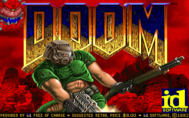

# Running DOOM on the RISC-V Emulator

*How the DOOM port works, end to end.*

DOOM runs as an ordinary bare-metal RV32 program on the emulator. It is the
[doomgeneric](https://github.com/ozkl/doomgeneric) engine (id Software's original
DOOM source, refactored so all platform-specific code lives behind six callbacks)
compiled for `rv32imac` and linked against newlib. The only thing the emulator adds
to support it is a small **semihosting host file-I/O interface** (ECALLs `0x505`-`0x50C`):
the guest reads the WAD off the host filesystem and pushes finished frames back to the
host as image files. No graphics hardware is emulated -- frames are written as PPM images
and (optionally) stitched into a video afterward.

The result: DOOM boots the shareware IWAD, plays its built-in attract demo, writes 60
frames, and exits cleanly.



That is an actual run: the 60 PPM frames the emulator wrote, stitched by
`make -C programs doom-gif`. It opens on the title screen and ends inside the demo
playback, which is all 60 frames buys at the engine's 35 fps -- a little under two
seconds.

---

## Quick start

```bash
make -C programs doom          # fetch doomgeneric source + build out/elf/doom.elf
make -C programs run-doom      # download the shareware WAD if missing, then run
make -C programs doom-video    # optional: stitch the PPM frames into doom.mp4 (needs ffmpeg)
make -C programs doom-gif      # optional: stitch the PPM frames into doom.gif (needs ffmpeg)
```

By default the WAD, the `doom_frame_*.ppm` files, and `doom.mp4`/`doom.gif` all live in a dedicated
`doom-run/` folder at the repo root (`$(DOOM_RUN_DIR)`). Override the location with:

```bash
make -C programs run-doom DOOM_RUN_DIR=/tmp/doom
```

Cleanup:

```bash
make -C programs clean       # removes the generated frames + video (keeps the cached WAD)
make -C programs doom-clean  # wipes the whole doom-run/ folder, WAD included
```

To run the emulator by hand, `cd` into the directory that holds `doom1.wad` (it is opened
by a *relative* path, and frames are written to the current working directory):

```bash
cd <dir with doom1.wad>
bin/riscv_emulator --machine qemu-virt programs/out/elf/doom.elf
```

---

## Big picture

```
   GUEST  (doom.elf, RV32IMAC, newlib)          HOST  (emulator, Ada)
   +---------------------------------+          +------------------------------+
   | main() -> doomgeneric_Create()   |          |                              |
   |          + doomgeneric_Tick()   |          |  RISCV.CPU.Step:             |
   |                                 |          |   ECALL handler              |
   |  fopen("doom1.wad") -+          |          |   a7 in 0x505..0x50C ?        |
   |                      | newlib   |  ecall   |    + 0x505 open  -> host file |
   |  fread(...) ---------+--------> | -------> |    + 0x506 read  -< host file |
   |                      | _open    |  a7=...  |    + 0x507 write -> host file |
   |  DG_DrawFrame() -----+ _read    |          |    + 0x508 close             |
   |    + ecall 0x50C (framebuffer)  |  a0=ret  |    + 0x509/0A/0B seek/tell/sz |
   |                                 | <------- |    + 0x50C draw  -> *.ppm     |
   |  exit(0)  (ecall a7=93) --------+--------> |   a7 = 93 > CPU.Halted        |
   +---------------------------------+          +------------------------------+
        320x200 ARGB32 framebuffer  ------------>  doom_frame_NNNNNN.ppm
```

Everything crosses the boundary through a single instruction: `ecall`. The syscall number
lives in `a7`, arguments in `a0`-`a2`, and the return value comes back in `a0`.

---

## The semihosting file-I/O interface (ECALLs 0x505-0x50C)

These extend the pre-existing host-log ECALLs (`0x500`-`0x504`). They are intercepted by
the emulator's `ECALL` handler (`src/riscv-cpu.adb` for RV32, `src/riscv-cpu64.adb` for
RV64) *before* the normal trap/SBI path, so from the guest's perspective an `ecall` with
one of these numbers behaves like a fast, non-trapping function call.

| a7 | Name | a0 / a1 / a2 | Returns (a0) |
|------|------|--------------|--------------|
| `0x505` | HOST_FILE_OPEN | path ptr / path len / mode (0=read, 1=write, 2=append) | handle `0..15`, or `0xFFFFFFFF` on error |
| `0x506` | HOST_FILE_READ | handle / buf ptr / count | bytes read (0 = EOF) |
| `0x507` | HOST_FILE_WRITE | handle / buf ptr / count | bytes written |
| `0x508` | HOST_FILE_CLOSE | handle | 0 |
| `0x509` | HOST_FILE_SEEK | handle / offset (signed) / whence (0=set, 1=cur, 2=end) | 0, or `-1` on error |
| `0x50A` | HOST_FILE_TELL | handle | current position |
| `0x50B` | HOST_FILE_SIZE | handle | size in bytes |
| `0x50C` | HOST_FB_DRAW | framebuffer ptr / frame no | 0 (writes `doom_frame_NNNNNN.ppm`) |
| `0x50D` | HOST_FB_TERM | framebuffer ptr | 0 (renders the frame to the terminal -- interactive mode) |
| `0x50E` | HOST_KEY_POLL | -- | next stdin byte, or 0 if none (non-blocking) |

### Host state

The emulator keeps a small fixed table in the `Memory_Unit` record
(`src/riscv-memory.ads`):

```ada
Max_SH_Files : constant := 16;
SH_Files     : SH_File_Array      := (others => null);  -- Stream_IO.File_Type handles
SH_File_Open : SH_File_Open_Array := (others => False); -- slot in use?
```

A guest "handle" is simply an index `0..15` into this table. Files are opened with
`Ada.Streams.Stream_IO` (`Create`/`Open` with `Out_File`, `Append_File`, or `In_File`
depending on the mode byte).

### How each call works (host side)

- **OPEN** copies the path string out of guest memory byte-by-byte (capped at 511 chars),
  finds the first free slot, and opens the file. Any exception (missing file, permission)
  is caught and reported as `0xFFFFFFFF`.
- **READ** streams the file into guest RAM in 4 KB chunks, writing each byte via
  `Memory.Write_Byte`. Hitting end-of-file (`Stream_IO.End_Error`, or a short read) stops
  early and returns the number of bytes actually delivered.
- **WRITE** does the reverse: pulls `count` bytes out of guest RAM (again in 4 KB chunks)
  and writes them to the stream.
- **SEEK / TELL / SIZE** map onto `Stream_IO.Set_Index` / `Index` / `Size`. Note Stream_IO
  positions are **1-based**, so the handler adds `+1` when converting from POSIX offsets.
- **CLOSE** closes the underlying file and frees the slot.

After a host call the handler advances `PC := Next_PC`, bumps the `instret`/`mcycle`
counters, and returns -- it never enters `Trap_Entry`.

---

## The frame dump (ECALL 0x50C)

DOOM renders into a 320x200 framebuffer of 32-bit pixels (`DG_ScreenBuffer`). Once per
frame the guest calls `ecall 0x50C` with `a0` = framebuffer pointer, `a1` = frame number.
The emulator then:

1. Builds the filename `doom_frame_NNNNNN.ppm` (6-digit zero-padded frame number).
2. Writes a binary [PPM](https://netpbm.sourceforge.net/doc/ppm.html) header:
   `P6\n320 200\n255\n`.
3. Walks all 64 000 pixels (as 500 chunks of 128), reading each pixel as one 32-bit word
   and unpacking the colour channels:

   ```
   pixel = 0xAARRGGBB     (DOOM framebuffer is ARGB: red_off 16, green_off 8, blue_off 0)
   R = (pixel >> 16) & 0xFF
   G = (pixel >>  8) & 0xFF
   B =  pixel        & 0xFF
   ```

   The alpha byte is dropped; R, G, B are written as three consecutive bytes (PPM `P6`).

Each `.ppm` is a plain 24-bit RGB image you can open directly, convert with ImageMagick
(`convert doom_frame_000000.ppm frame0.png`), or feed to `ffmpeg`.

---

## Interactive (in-terminal) mode

By default DOOM runs headless and dumps PPM frames. A second build --
`doom-tty.elf`, compiled with `-DDOOM_INTERACTIVE` -- instead plays *live in your terminal*:

```bash
make -C programs run-doom-tty
```

Controls: **WASD** move/turn, **Q/E** strafe, **SPACE** fire, **F** use/open, **1-7** select
weapon, **ENTER/ESC** menu, **`** (backtick) quit. Use a terminal at least 100 cols x 34
rows. The emulator runs DOOM at roughly ~0.5-1 fps, so play is deliberate, not twitchy. If
the terminal is left in a odd state after an abnormal exit, run `reset`.

Two extra ECALLs drive it, both handled in `src/riscv-cpu.adb` and implemented in the
`RISCV.Term_IO` package (`src/riscv-term_io.adb`):

- **`0x50D` HOST_FB_TERM** -- the guest passes the framebuffer pointer once per frame. The
  emulator samples the 320x200 image down to a 100x32 character grid and prints it using the
  Unicode **upper-half-block** `#` with 24-bit ANSI colour: the *foreground* colour is the
  top pixel of the cell, the *background* colour is the bottom pixel, so each character shows
  two vertically-stacked pixels. Frames are drawn over the [alternate screen buffer] with the
  cursor homed each frame (no scrolling/flicker), and only colour *changes* emit an escape
  sequence to keep the byte count down.
- **`0x50E` HOST_KEY_POLL** -- a non-blocking single-byte read from the host's stdin (via
  `read(0, ...)` after putting the tty in `-echo -icanon min 0 time 0` raw mode). Returns 0
  when no key is waiting.

On the guest side (`doomgeneric_riscv.c`, under `#ifdef DOOM_INTERACTIVE`):

- `DG_DrawFrame` calls `0x50D` (present) then drains `0x50E` (poll) each frame.
- Terminals report key **presses** only, never releases. So each pressed key is marked
  "held" for a few frames; a keydown event is queued on the first press and a keyup once the
  hold lapses. Terminal auto-repeat re-arms the hold, so holding a key yields continuous
  movement. Events are handed to DOOM through `DG_GetKey` from a small ring buffer.
- The raw byte is translated to doomgeneric key codes (`doomkeys.h`); backtick calls
  `exit(0)`, which triggers `RISCV.Term_IO.End_Session` on the host to restore the terminal.

[alternate screen buffer]: https://invisible-island.net/xterm/ctlseqs/ctlseqs.html#h3-The-Alternate-Screen-Buffer

## The guest program (`programs/doom/`)

The four "glue" files below plus the doomgeneric engine source are tracked in git; the
engine is vendored under `doomgeneric/` (GPLv2 -- see `programs/doom/README.md`) because
the port depends on bare-metal modifications that do not exist upstream. `doom1.wad` and
the run artifacts (`doom_frame_*.ppm`, `doom.mp4`, `doom.gif`) are **gitignored** and fetched or
produced on demand -- no DOOM game data is distributed.

| File | Role |
|------|------|
| `crt0_doom.S` | Reset vector: set `sp`, zero `.bss`, call `main(0, NULL)`, then `exit`. |
| `hello_doom.ld` | Linker script: RAM @ `0x80000000`, 128 MB, 8 MB stack at top. |
| `doomgeneric_riscv.c` | The doomgeneric platform layer -- the six `DG_*` callbacks. |
| `newlib_syscalls.c` | newlib retargeting: `_open`/`_read`/`_write`/`_close`/`_lseek`, `_sbrk`, stubs. |

### Startup (`crt0_doom.S`)

Minimal reset code: point `sp` at `_stack_top` (top of the 128 MB region), zero the BSS
one word at a time, call `main(0, NULL)`, and on return issue `ecall` with `a7 = 93`
(the standard newlib/Linux `exit`), which the emulator turns into `CPU.Halted := True`.

### `main` (`doomgeneric_riscv.c`)

```c
char *argv[] = { "doom", "-iwad", "doom1.wad", "-nomusic", "-nosound", 0 };
doomgeneric_Create(5, argv);   // engine reads the WAD here (via _open/_read)
while (1) doomgeneric_Tick();   // one frame per tick
```

`-iwad doom1.wad` is why the WAD must sit next to the emulator's working directory;
`-nomusic -nosound` disable audio (there is no sound device).

### The six doomgeneric callbacks

| Callback | Implementation |
|----------|----------------|
| `DG_Init()` | Records the start time from CLINT `mtime`. |
| `DG_DrawFrame()` | `ecall 0x50C` to dump the framebuffer, then `exit(0)` after `MAX_FRAMES` (60). |
| `DG_SleepMs(ms)` | Busy-waits on `mtime` (treated as 10 MHz) until the deadline. |
| `DG_GetTicksMs()` | `(mtime - start) x 1000 / 10 MHz`. |
| `DG_GetKey()` | Returns 0 (no input) -- so DOOM falls back to its built-in demo loop. |
| `DG_SetWindowTitle()` | Ignored. |

### Timing

There is no wall clock; time comes from the CLINT `mtime` register (memory-mapped at
`0x0200_BFF8`), which the emulator increments once per instruction. The guest treats
`mtime` as a 10 MHz counter (`MTIME_FREQ`). That's what makes the demo advance at a
sane pace and what `DG_SleepMs` / `DG_GetTicksMs` are built on -- game time is tied to
instructions executed, not to the host's real clock.

### newlib bridge (`newlib_syscalls.c`)

doomgeneric uses standard C file I/O (`fopen`/`fread`/`fseek`), which newlib lowers to the
POSIX `_open`/`_read`/`_write`/`_close`/`_lseek` syscalls. This file implements them on top
of the semihosting ECALLs, with a simple fd convention:

```
fd 0        = stdin   (no input)
fd 1, 2     = stdout / stderr  -> written to the UART at 0x10000000
fd 3 .. 18  = host file handles 0..15   (fd = handle + 3)
```

It also provides `_sbrk` (a bump allocator starting at the linker's `_end`, backing
newlib's `malloc`), no-op retargetable-lock stubs (single-threaded), and small stubs for
`_fstat`/`_isatty`/`getenv`/`atexit`/etc. that DOOM touches.

---

## Build system (`programs/Makefile`)

| Target | What it does |
|--------|--------------|
| `doom` | Fetches the doomgeneric source (first run) and builds `out/elf/doom.elf`. |
| `doom-wad` | Downloads the shareware `doom1.wad` into `$(DOOM_RUN_DIR)` if missing. |
| `run-doom` | Depends on the ELF **and** the WAD; runs the (headless, PPM) emulator in `$(DOOM_RUN_DIR)`. |
| `doom-video` | Stitches `doom_frame_*.ppm` -> `doom.mp4` (via ffmpeg). |
| `doom-gif` | Stitches `doom_frame_*.ppm` -> `doom.gif` (via ffmpeg), falling back to `doom.mp4` if the frames are gone. |
| `doom-tty` | Builds `out/elf/doom-tty.elf` (`-DDOOM_INTERACTIVE`). |
| `run-doom-tty` | Runs the interactive, in-terminal build (live keyboard + ANSI rendering). |
| `doom-clean` | Removes the whole `$(DOOM_RUN_DIR)` folder (frames, video, and cached WAD). |

`make clean` also removes the generated `doom_frame_*.ppm`, `doom.mp4`, and `doom.gif` from
`$(DOOM_RUN_DIR)`, but keeps the cached WAD so it isn't re-downloaded on the next run.

Key mechanics:

- **Source fetch:** the `doom.elf` rule has an order-only prerequisite on
  `doom/doomgeneric`, whose rule `curl`s the doomgeneric tarball and extracts it. The
  platform-specific backends (`doomgeneric_sdl.c`, `_xlib.c`, `_ntdrv.c`, `i_main.c`) are
  filtered out; our `doomgeneric_riscv.c` supplies `main` and the callbacks instead.
- **Build flags:** `-march=rv32imac -mabi=ilp32 -O2 -nostartfiles`, linked with
  `-T doom/hello_doom.ld -lc -lm -lnosys` (newlib C + math + `nosys` fallbacks, though our
  `newlib_syscalls.c` overrides the ones DOOM actually uses).
- **`DOOM_RUN_DIR`** (default: `doom-run/` at the repo root) is the single directory the run/video targets
  operate in. Both `cd` into it and reference the emulator/ELF by absolute path, so the
  targets work no matter where `make` is invoked. `run-doom` depends on
  `$(DOOM_RUN_DIR)/doom1.wad`, so a cold `make run-doom` auto-downloads the WAD -- the same
  pattern used to auto-fetch the engine source.

---

## End-to-end walkthrough of one run

1. `make run-doom` builds `doom.elf`, ensures `doom1.wad` is present, and launches the
   emulator with its CWD set to `$(DOOM_RUN_DIR)`.
2. `crt0_doom.S` sets up the stack, clears BSS, and calls `main`.
3. `main` calls `doomgeneric_Create`, which opens `doom1.wad` -- newlib `fopen` -> `_open`
   -> `ecall 0x505` -> the emulator opens the real file and returns a handle. The engine then
   `fread`s lumps (`ecall 0x506`) and `fseek`s around the WAD (`ecall 0x509`/`0x50A`).
4. Each `doomgeneric_Tick` renders one frame into `DG_ScreenBuffer` and calls
   `DG_DrawFrame`, which fires `ecall 0x50C`; the emulator unpacks the ARGB framebuffer and
   writes `doom_frame_NNNNNN.ppm`.
5. Because `DG_GetKey` returns no input, DOOM runs its attract demo (title screen -> demo
   playback).
6. After 60 frames `DG_DrawFrame` calls `exit(0)` -> `ecall a7=93` -> the emulator halts.
7. `make doom-video` turns the 60 PPMs into `doom.mp4`; `make doom-gif` turns them into
   `doom.gif` (a self-contained 256-colour palette built from the clip, ~460KB) -- the
   GIF at the top of this page is exactly that output.

**Verified 2026-07-01:** frame 0 is the DOOM title screen; frame ~45-59 is in-game demo
footage with the HUD and monsters visible; the program exits cleanly.

---

## Limitations & how to extend

- **Input:** the default `doom.elf` is headless (attract demo only). The interactive
  `doom-tty.elf` build adds live keyboard input -- see [Interactive mode](#interactive-in-terminal-mode)
  above. There is still no gamepad/mouse support.
- **No sound.** Audio is disabled (`-nomusic -nosound`); there is no audio device.
- **Framerate.** The emulator runs DOOM at ~0.5-1 fps, so interactive play is deliberate.
- **Fixed 60-frame capture.** Raise `MAX_FRAMES` in `doomgeneric_riscv.c` for a longer run
  (more `.ppm` files, longer video).
- **Frames are files, not a live window.** Rendering is offline: PPM per frame, then video.
  A live path would mean streaming frames to a host-side display instead of `Create`-ing a
  file per frame.
- **RV32 only in practice.** The file-I/O ECALLs exist in both the RV32 (`riscv-cpu.adb`)
  and RV64 (`riscv-cpu64.adb`) cores, but `doom.elf` is built `rv32imac`.

---

## Source map

| Layer | Files |
|-------|-------|
| Guest glue | `programs/doom/crt0_doom.S`, `hello_doom.ld`, `doomgeneric_riscv.c`, `newlib_syscalls.c` |
| Guest engine | `programs/doom/doomgeneric/` (vendored, GPLv2) |
| Host ECALLs | `src/riscv-cpu.adb`, `src/riscv-cpu64.adb` (cases `0x505`-`0x50C`); `0x50D`/`0x50E` in `riscv-cpu.adb` |
| Host file table | `src/riscv-memory.ads` (`SH_Files`, `SH_File_Open`, `Max_SH_Files`) |
| Terminal renderer + keyboard | `src/riscv-term_io.ads/.adb` (`Present_Frame`, `Poll_Key`, `End_Session`) |
| Build/run | `programs/Makefile` (`doom`, `doom-wad`, `run-doom`, `doom-video`, `doom-gif`) |

See also `STATUS.md` (Sec. DOOM Port) and the semihosting ECALL table there.
